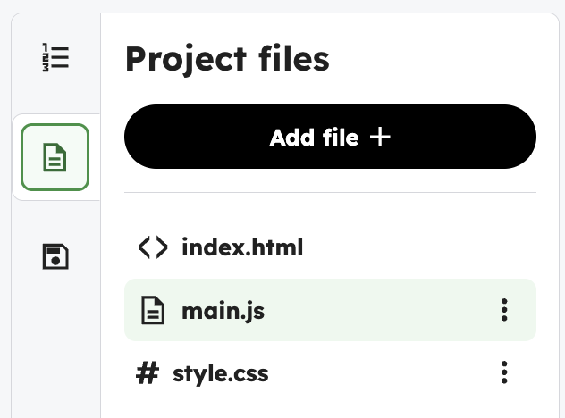
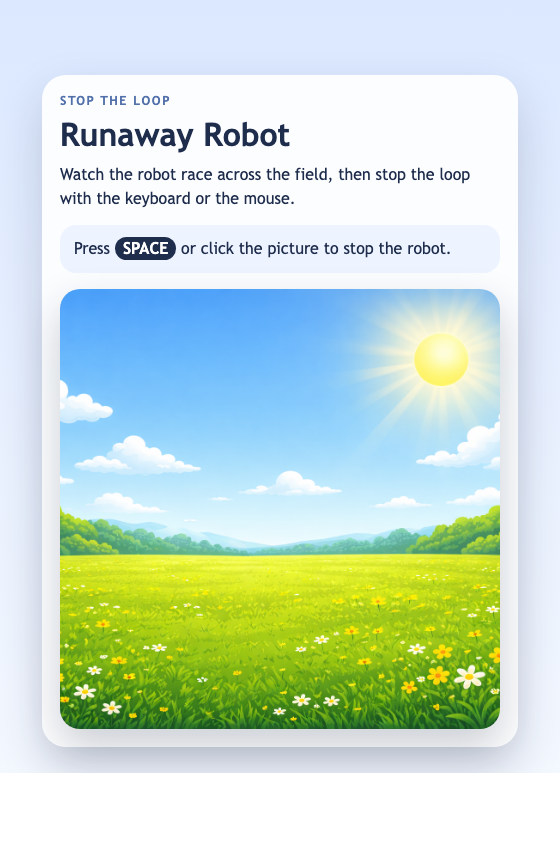

<h2 class="c-project-heading--task">Start main.js</h2>

Build the main sketch file so the project can open a canvas and get the robot image ready.

### Step 1

Open the blank `main.js` from the file list. This is where we will be working.  (Not `index.html`!)

### Step 2

Start by adding your variables and the basic functions: preload(), setup(), and an empty draw().

In preload(), load the image robot.png so it’s ready before the program starts.

In setup(), create your canvas and place it inside the sketch-holder section of the page so it shows up in the right spot.

--- code ---
---
language: javascript
filename: main.js
line_numbers: true
line_number_start: 1
line_highlights: 1-20
---
const robotWidth = 108; // Robot image width
const robotHeight = 130; // Robot image height

let runnerX = 60; // Robot horizontal position
let runnerY = 190; // Robot vertical position
let runnerSpeed = 4; // Pixels to move each frame
let keepRunning = true; // Track whether the robot should move
let robotImage; // Store the loaded robot image

function preload() { // Load files before the sketch starts
  robotImage = loadImage("robot.png"); // Load the robot picture
}

function setup() { // Run once when the sketch starts
  const canvas = createCanvas(400, 400); // Make a 400 by 400 canvas
  canvas.parent("sketch-holder"); // Put the canvas in the page container
}

function draw() { // Run every frame
}
--- /code ---

<h2 class="c-project-heading--task">Test</h2>

Run the project and make sure a `400` by `400` canvas opens below the page text.

  

