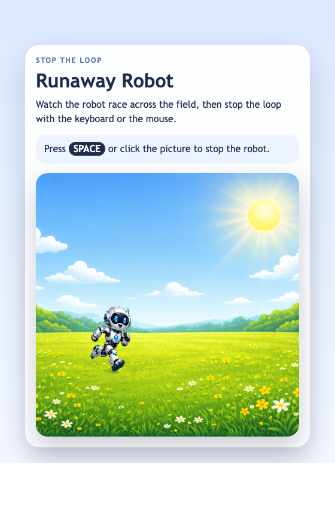

<h2 class="c-project-heading--task">Show the Robot</h2>

Draw the robot on a transparent canvas so the HTML backdrop stays visible behind it.

### Step 1

`index.html` already shows the backdrop image and the words above the sketch. Replace the empty `draw()` function so it clears the canvas and draws the robot image on top.

### Step 2

Use `clear()` so the canvas stays transparent, then draw `robotImage` using `runnerX` and `runnerY`.

--- code ---
---
language: javascript
filename: main.js
line_numbers: true
line_number_start: 19
line_highlights: 20-21
---
function draw() {
  clear(); // Keep the canvas transparent
  image(robotImage, runnerX, runnerY, robotWidth, robotHeight); // Draw the robot
}
--- /code ---

<h2 class="c-project-heading--task">Test</h2>

Run the project and check that you can see the field backdrop behind the robot, with the page text above the canvas.

  

