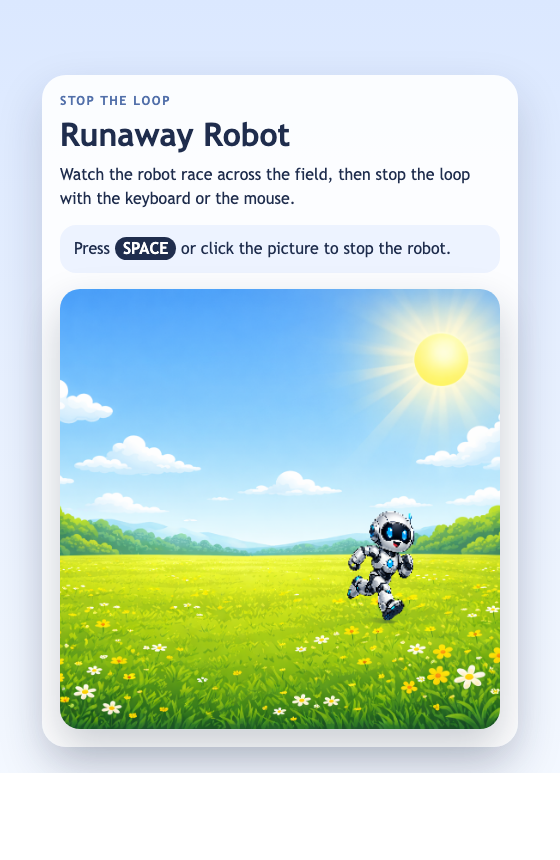

<h2 class="c-project-heading--task">Make the Robot Run</h2>

Use the draw loop to move the robot across the field again and again.

### Step 1

The backdrop and robot are ready, but the robot stays still. Change `runnerX` inside `draw()` so the loop moves the robot every frame.

### Step 2

Move the robot while `keepRunning` is `true`. Let it run off the right edge, then send it back to the left so it appears again from offscreen.

--- code ---
---
language: javascript
filename: main.js
line_numbers: true
line_number_start: 19
line_highlights: 20-28
---
function draw() {
  clear();
  image(robotImage, runnerX, runnerY, robotWidth, robotHeight);

  if (keepRunning) { // Only move while the loop is active
    runnerX = runnerX + runnerSpeed; // Move the robot to the right
    if (runnerX > width) { // When it has fully left the canvas
      runnerX = -robotWidth; // Start again off the left edge
    }
  }
}
--- /code ---

<h2 class="c-project-heading--task">Test</h2>

Run the project and watch the robot run off the right edge, then appear again from the left and keep going.

  

