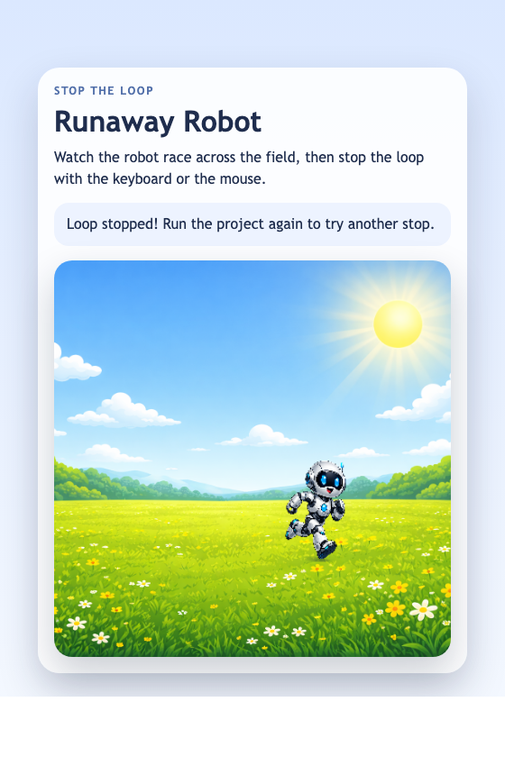

<h2 class="c-project-heading--task">Stop the Loop with SPACE</h2>

Use the keyboard to turn the robot's running loop off.

### Step 1

Run the project. `draw()` keeps running, so the robot keeps moving and the status text still tells you how to stop it.

### Step 2

Go below `draw()` in `main.js`, then add a `stopRunner()` function and a new `keyPressed()` function. Make `stopRunner()` set `keepRunning` to `false` and update the `status-text` message in the HTML page. Make `keyPressed()` check for the `SPACE` key and call `stopRunner()`.

--- code ---
---
language: javascript
filename: main.js
line_numbers: true
line_number_start: 31
line_highlights: 31-40
---
function stopRunner() { // Stop the robot and update the page
  keepRunning = false; // Freeze the robot
  document.getElementById("status-text").textContent =
    "Loop stopped! Run the project again to try another stop."; // Show the stopped message
}

function keyPressed() { // Run when a key is pressed
  if (key === " ") { // Check for SPACE
    stopRunner(); // Reuse the stop code
  }
}
--- /code ---

<h2 class="c-project-heading--task">Test</h2>

Run the project and press `SPACE`. The robot should stop where it is and the page message should change to `Loop stopped!`.

  

